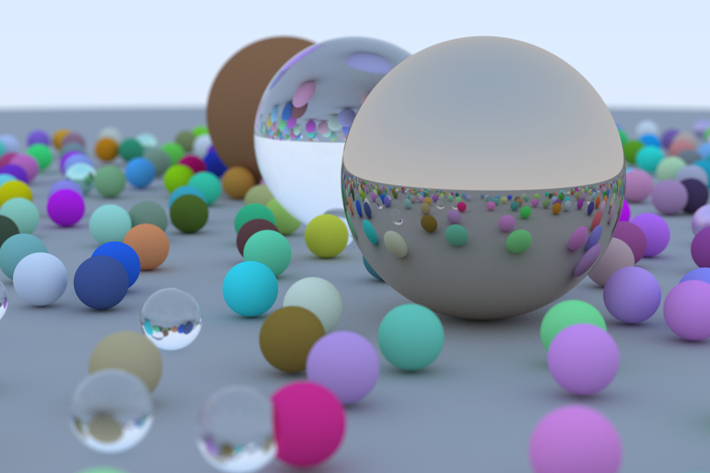
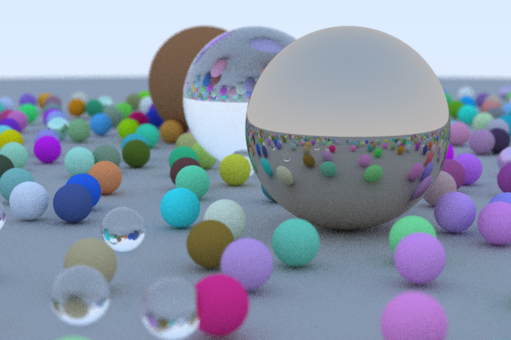

# Ray-Tracer
Code is heavily inspired / taken at parts from the tutorial:
https://raytracing.github.io/books/RayTracingInOneWeekend.html but cuda
accelerated (although there are a few notable differences, such as how images are treated, lack of polymorphism in my code, etc)

## Screenshots:

  

  

The first image took about 7 minutes to render but is the result of rendering at 500
samples_per_pixel and a max_depth of 50 (similar to what the tutorial does).

The second image's performance is mentioned in the performance section. It
didn't take long but visually is worse.

## Dependencies
- CUDA + NVCC compiler
- OpenCV (only for image I/O)
- Gtest (tests)

## Tested on
- CPU: Intel Core i5 (4 core, 7th gen)
- GPU: Nvidia GeForce GTX 1050M

**Note** I ran experiments on a laptop.

## Performance
All my tests were run in the same environment (I ran one after the other) but I
didn't do a very lengthy performance analysis. All experiments were run using
identical settings (`samples_per_pixel` at 10 and `max_depth` at 50). Note, all
3 implementations give you the grainy results that I showed in the screenshots.
You'll need to increase the number of samples per pixel to avoid that (at the
cost of terrible perf).

My implementation took a total of 7936175 µs (7.93 s).

When testing the online CUDA implementation
(https://github.com/rogerallen/raytracinginoneweekendincuda/tree/ch12_where_next_cuda)
on my laptop, I got ~10.3 s. Note I made changed the code so that it did not
consider the time it took to generate a random state. I did this to make it a
more fair comparison with my implementation. If I didn't make this change, I
would have gotten ~11.6 s.

Similarly, I tested the original CPU implementation (https://github.com/RayTracing/raytracing.github.io) as well. I added a similar
method of timekeeping that I use to record how long it took. Similar to the
above two, it only considers the time to render objects. It took ~549967696 µs
(550 s). I have a fairly weak CPU so this is reasonable I guess (and I had
things running in the background), but I might investigate later why this
happened (it's slower than I expected).

Overall, my implementation ended up being the fastest. This makes sense because
I render the final image on GPU and avoid a few potential performance hitting
things. My implementation is also the least flexible however (but I'd argue that
it's not too bad). The most unflexible parts currently are needing to know the
sphere array size at runtime (but I could have implemented a vector wrap around
if I wanted) and scaling the surfaces. I could employ a similar strategy to what I did for materials however to make surface more scalable. My inspiration for my material impl came from: https://stackoverflow.com/questions/4801833/avoiding-virtual-functions

The CUDA article also notes on his personal machine, the CPU version took about
90 s, and his implementation took about 6.7 s (GTX 1070) and 4.7 s (RTX 2080).
This is faster than what I reported for both.

## Summary of Performance

Once again, these results are for `samples_per_pixel` at 10 and `max_depth` at 50.

Implementation              | Time (s)
----------------------------|---------
Mine (my machine)           | 7.93 s
CUDA article (my machine)   | 10.3 s
CPU (my machine)            | 550 s (~ 9 min)
GTX 1070 (article machine)  | 6.7 s
RTX 2080 (article machine)  | 4.7 s
CPU (article machine)       | 90 s

## Note about the tests
- Changed to testing to ensure behavior of my images don't change with additions
  rather than testing against website due to randomness. I instead made sure
  they looked visually similar.

## References
- https://raytracing.github.io/books/RayTracingInOneWeekend.html
- https://developer.nvidia.com/blog/accelerated-ray-tracing-cuda/
- https://stackoverflow.com/questions/4801833/avoiding-virtual-functions
